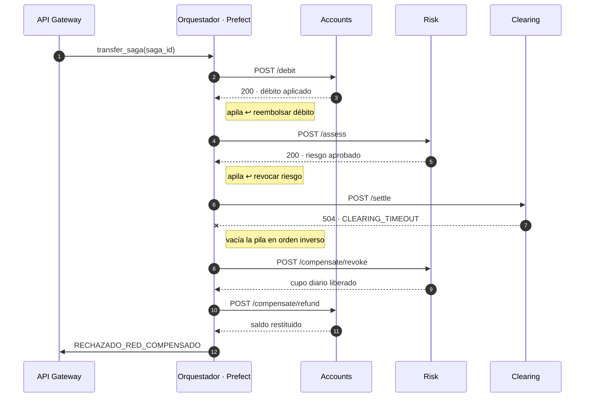
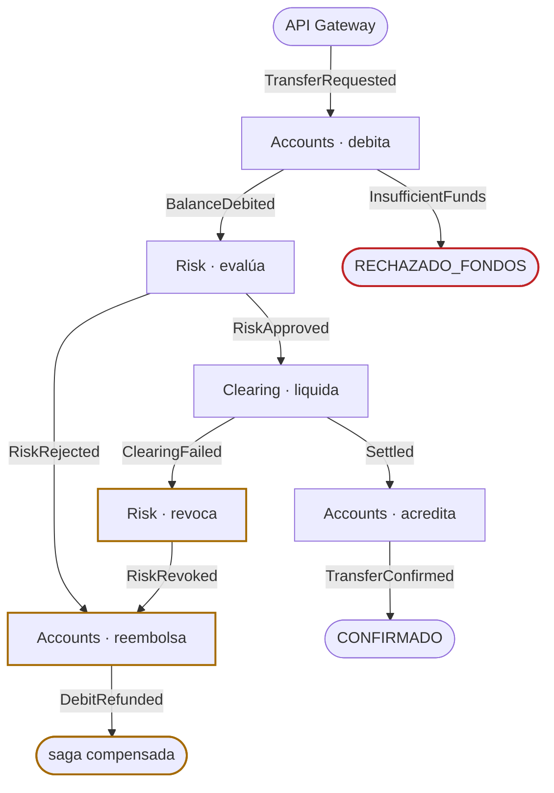

Escrito para: el docente evaluador del taller.

# Orquestación vs. Coreografía en la Saga de NovaBank

Ambas modalidades están implementadas sobre los **mismos tres microservicios y
las mismas transacciones de compensación**. Lo único que cambia es quién decide
el siguiente paso. Esa separación es deliberada: permite atribuir cualquier
diferencia de comportamiento al mecanismo de coordinación y no a la lógica de
negocio.

## 1. Cómo se ejecuta cada modalidad

### Orquestación — `gateway/app/orchestrator.py`

Un flow de Prefect conoce la secuencia completa e invoca cada servicio por HTTP:

```
debit → assess_risk → settle → credit
```

Mantiene una **pila de compensaciones**. Cada paso exitoso apila su reversa, y
el manejador de error la vacía en orden LIFO:

```python
compensations = []
try:
    await debit(...);       compensations.append(refund_debit)
    await assess_risk(...); compensations.append(revoke_risk)
    await settle(...);      compensations.append(cancel_settlement)
    await credit(...)
except StepFailed:
    for compensate in reversed(compensations):
        await compensate(saga_id)
```

El orden inverso no es una convención documentada: es una propiedad estructural
de la pila. Y solo se apila lo que realmente tuvo éxito, de modo que CP-02
(fallo en el primer paso) encuentra la pila vacía y no compensa nada.

El flujo completo del CP-04 (caída de la red externa), donde se ve que todas las
flechas nacen y mueren en el orquestador:



El orquestador es el único que habla con todos: los servicios no se conocen
entre sí, pero ninguno avanza sin que él se lo ordene.

### Coreografía — `on_event` en cada servicio

El gateway publica **un único evento** y deja de participar:

```python
await publish("TransferRequested", saga_id, {...})
```

A partir de ahí cada servicio reacciona por su cuenta a los eventos que le
interesan, y emite el resultado como un nuevo evento:

| Servicio | Escucha | Emite |
| :--- | :--- | :--- |
| Accounts | `TransferRequested` | `BalanceDebited` · `InsufficientFunds` |
| Risk | `BalanceDebited` | `RiskApproved` · `RiskRejected` |
| Clearing | `RiskApproved` | `Settled` · `ClearingFailed` |
| Accounts | `Settled` | `TransferConfirmed` |
| Risk | `ClearingFailed` | `RiskRevoked` |
| Accounts | `RiskRejected` · `RiskRevoked` | `DebitRefunded` |

Ningún servicio aparece dos veces en la misma columna de escucha por el mismo
evento, y ninguno escucha un evento que él mismo emite: **no hay ciclos**.

Los cinco casos de prueba sobre el mismo grafo de suscripciones. No hay ningún
nodo central: cada flecha es un evento en el bus, y cada caja decide sola:



La rama en ámbar es la clave y merece leerse despacio: `ClearingFailed` no llega
a Accounts, llega a Risk. Es `RiskRevoked` —el evento que Risk emite *después*
de compensar lo suyo— el que despierta a Accounts.

### El problema difícil de la coreografía: el orden inverso

Sin coordinador, nadie "sabe" que hay que compensar en reversa. La solución
aquí es que **las compensaciones forman su propia cadena de eventos**:

```
ClearingFailed ─► Risk revoca ─► RiskRevoked ─► Accounts reembolsa ─► DebitRefunded
```

Accounts no reembolsa al ver `ClearingFailed`, sino al ver `RiskRevoked`. Esa
dependencia es lo que garantiza que la revocación de riesgo ocurra **antes** del
reembolso del débito, es decir, el inverso exacto del orden de ejecución, sin
que exista ninguna autoridad central. El orden emerge de la topología de
suscripciones.

La evidencia está en la bitácora de CP-04, idéntica en las dos modalidades:

```
4. CLEARING  clearing  FAILED
5. RISK      risk      COMPENSATED    ← primero se revierte el paso más reciente
6. DEBIT     accounts  COMPENSATED    ← después el más antiguo
```

## 2. Diferencias observadas

| Dimensión | Orquestación | Coreografía |
| :--- | :--- | :--- |
| Conocimiento del flujo | Centralizado en el flow | Distribuido: cada servicio conoce solo su vecindad |
| Acoplamiento | Los servicios no se conocen, pero **todos dependen del orquestador** | Nadie conoce a nadie; dependen del **contrato de eventos** |
| Añadir un paso intermedio | Se edita un archivo | Hay que reencadenar suscripciones de varios servicios |
| Entender el flujo completo | Se lee de un vistazo | Exige reconstruirlo a partir de los suscriptores |
| Punto único de fallo | Sí: si cae el orquestador la saga queda en limbo | No: el bus reparte y reintenta |
| Orden de compensación | Explícito (pila LIFO) | Emergente (cadena de eventos) |
| Depuración | Trivial: un stack trace, una traza de Prefect | Costosa: hay que correlacionar por `saga_id` |
| Latencia | Un salto HTTP por paso | Un salto de bus por paso, pero en paralelo si hay ramas |
| Acoplamiento temporal | Alto: el orquestador espera cada respuesta | Bajo: si un servicio está caído, su evento espera en el stream |

## 3. Qué recomendaríamos para NovaBank en producción

**Orquestación**, por tres razones propias del dominio bancario:

1. **Auditoría regulatoria.** Un supervisor financiero pregunta "¿por qué esta
   transferencia quedó en este estado?". El flow responde esa pregunta en un
   archivo; la coreografía exige reconstruir el razonamiento desde los eventos.
2. **Las sagas de pago son secuenciales por naturaleza.** No hay ramas paralelas
   que justifiquen la complejidad del bus: debitar antes de evaluar riesgo y
   liquidar después no es una decisión de diseño, es el negocio.
3. **El orden de compensación es requisito, no preferencia.** En orquestación es
   una garantía estructural; en coreografía depende de que nadie rompa la cadena
   de suscripciones al añadir un servicio — es correcto, pero frágil ante el
   mantenimiento.

La coreografía es preferible cuando el número de participantes crece y no se
conoce de antemano (notificaciones, analítica, motores antifraude que se
suscriben sin que el flujo principal lo sepa). El patrón sensato es híbrido:
**orquestar el camino crítico del dinero y coreografiar los efectos
secundarios.**

## 4. Consistencia eventual: cómo se evita el dinero perdido

Tres mecanismos, independientes de la modalidad:

**Compensación aditiva.** Ninguna compensación borra ni actualiza el asiento
original: escribe un asiento `REFUND` de signo contrario. El saldo se restituye
y la auditoría conserva la historia completa, incluido el error.

**Idempotencia local.** La clave primaria `(saga_id, operation)` de
`processed_operations` hace físicamente imposible ejecutar dos veces la misma
operación de la misma saga. Verificado en CP-05: tres reintentos del mismo UUID
dejan el saldo inalterado. Al ser local y no del coordinador, protege igual en
coreografía, donde un evento puede reentregarse.

**Fallo de compensación marcado, no silenciado.** Si una compensación falla, el
orquestador registra `FAILED` con `is_compensation = true` en lugar de
propagar la excepción. La saga queda explícitamente señalada para intervención
manual en vez de quedar en un limbo invisible — que es el peor resultado posible
en un sistema de pagos.

**Límite conocido.** Entre el débito y su compensación existe una ventana de 2 a
4 segundos en la que el dinero no está en ninguna de las dos cuentas. Eso es
inherente al modelo BASE y es precisamente lo que el 2PC evitaría a cambio de
bloqueos globales. Los delays configurables del taller hacen esa ventana
visible en pantalla en lugar de ocultarla.
